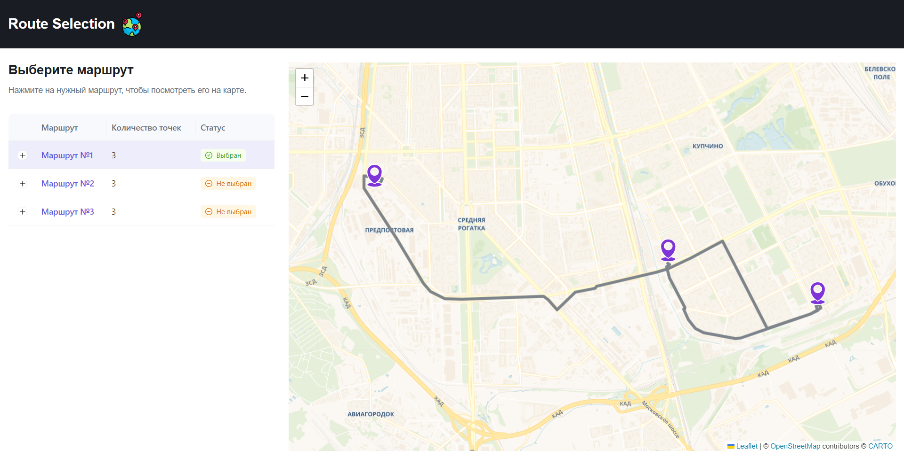

# Route Selection

React SPA приложение для отображения маршрутов на карте.

## Содержимое

- [Ссылка](#ссылка)
- [Задание](#задание)
- [Использованные технологии](#использованные-технологии)
- [Скриншоты](#Скриншоты)
- [Запуск приложения](#запуск-приложения)
---

### Ссылка
[Ссылка на приложение]().

### Использованные технологии

- **React.js**, **Typescript**;
- Карта - **Leaflet**;
- Маршрут - **OSRM API**;
- Библиотека компонентов - **AntDesign**;
- Хранения глобального состояния - **Redux toolkit**;
- Реация на события - **Redux Saga**
- Сборка приложения - **Vite**
### Задание

| Задание                          |
| -------------------------------- | 
|Отобразить заданный набор маршрутов с координатами в **таблице** и на **карте**;| 
|Выбранный маршрут отображается на карте в виде **точек** и **полилинии**;|
|Маршрут запрашивается из сервиса построения треков по дорогам **OSRM**;|
|При выборе маршрута карта **центрируется к маршруту**;| 


### Скриншоты



### Запуск приложения

Установите зависимости:
```
npm install
```

Затем, запустите приложение:

```bash
npm run dev
# or
yarn dev
# or
pnpm dev
```